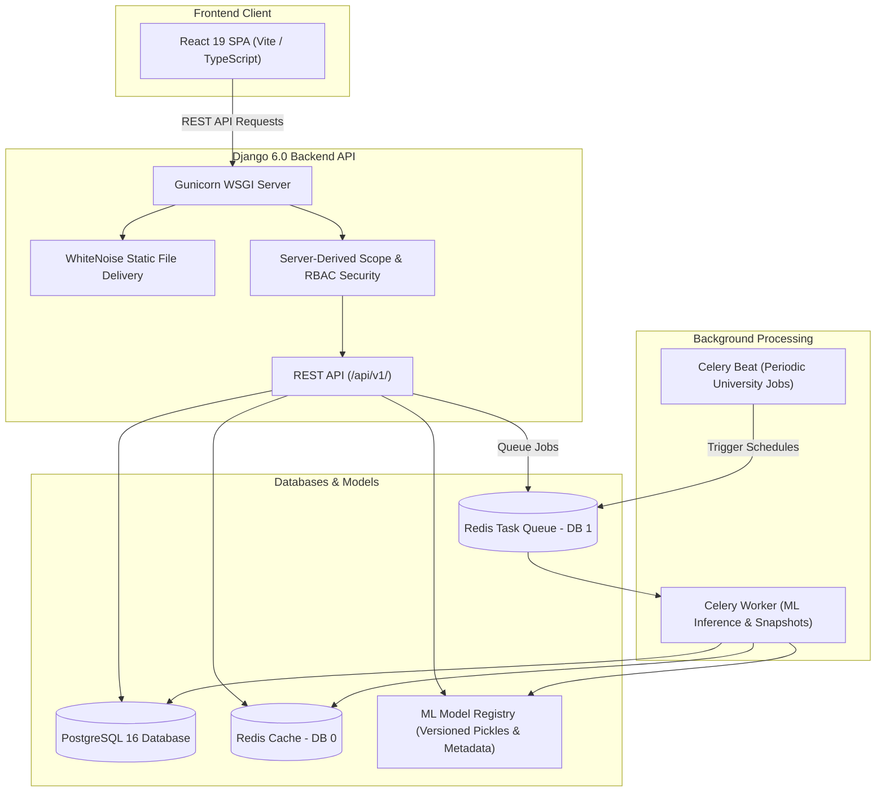

# 🎓 EduPulse: Student Performance Prediction & Academic Early-Warning Platform

[](https://github.com/AmanYdv77/edupulse/actions/workflows/ci.yml)
[](https://www.python.org/)
[](https://www.djangoproject.com/)
[](https://react.dev/)
[](https://www.typescriptlang.org/)
[](https://www.postgresql.org/)
[](https://redis.io/)
[](https://docs.celeryq.dev/)
[](https://scikit-learn.org/)
[](https://opensource.org/licenses/MIT)

**EduPulse** is an institutional academic platform that helps universities spot learning difficulties and academic risks **weeks before semester exams happen** — giving educators and students the time they need to take action and improve outcomes.

Most traditional college management systems only record grades *after* exams are already over (when it's too late to help). EduPulse bridges this gap by combining **daily/weekly habit tracking** (study hours, sleep, attendance) with an **ethical, privacy-first Machine Learning engine** that provides personalized insights and early warnings.

---

## 💡 Why EduPulse?

* **For Students:** Understand your learning habits, track study streaks, get realistic grade forecasts, and see clear, actionable advice on how to improve.
* **For Faculty & Teachers:** An **At-Risk Radar** flags students who are slipping behind in specific subjects early in the semester so you can offer timely support or tutoring.
* **For Department Heads (HODs) & Deans:** Monitor department-wide academic health, course-level difficulty trends, and cohort distributions across semesters.
* **For University Leadership:** High-level institutional intelligence dashboards with **complete privacy protection** (zero student names or sensitive personal information exposed).

---

## ⚡ Key Highlights & Architecture

### 1. 🧠 Dual-Model Machine Learning Engine
EduPulse uses a two-tier approach to ensure reliable predictions:
* **Model A (Prior Baseline):** Trained on student behavioral factors to provide early baseline expectations when historical campus data is still limited.
* **Model B (Longitudinal Institutional Model):** Trained strictly on verified campus records using `GroupedKFold` cross-validation — ensuring student records never leak across training and evaluation splits.
* **Demographic Quarantine (Ethical AI):** We strictly prohibit sensitive attributes (such as gender, ethnicity, socioeconomic status, and family income) from being used as model inputs. Predictions are based purely on academic effort and habits.
* **Transparent Explanations:** Every prediction is broken down into plain-English factors (e.g., *"Low weekly study hours (-4.2 pts)"* or *"Strong internal assessment score (+6.1 pts)"*).

### 2. 🛡️ Role-Based Access Control (RBAC) & Privacy
Permissions are enforced strictly on the server:
* Every user only accesses the data they have permission to see.
* Student privacy is preserved: executive analytics aggregate statistics and strip all Personally Identifiable Information (PII).

### 3. 🚀 High-Performance Asynchronous Stack
* **Dual Redis Setup:** One isolated Redis instance for caching (`redis-cache`) and another dedicated to background task queues (`redis-broker`).
* **Celery Background Workers:** Automatically compute and update campus-wide predictions and score snapshots in the background without slowing down the user experience.
* **Generational Caching:** Fast response times with automatic cache invalidation whenever new marks or attendance records are submitted.

### 4. 🎨 Modern Dark-Theme React Frontend
* Built with **React 19**, **TypeScript**, and **Vite** with a polished, accessible dark theme.
* Fast, responsive interface with interactive dashboards, habit logging studios, and real-time performance radars.

---

## 🏛️ System Overview



---

## 🚀 Quickstart with Docker Compose

The easiest way to run the entire EduPulse stack (Database, Dual Redis, Web Server, Celery Worker, and Beat) is using Docker Compose:

### Prerequisites
* [Docker Desktop](https://www.docker.com/products/docker-desktop/) (v24.0+)
* [Docker Compose](https://docs.docker.com/compose/) (v2.20+)

### 1. Clone & Launch
```bash
# Clone repository
git clone https://github.com/AmanYdv77/edupulse.git
cd edupulse

# Build and start all services in the background
docker compose up -d --build
```

### 2. Check Services Status
```bash
docker compose ps
```

Once up, open **`http://localhost:8000`** in your browser to access EduPulse!

---

## 💻 Local Development Setup

If you prefer to run the backend and frontend directly on your machine:

### 1. Set Up Python Virtual Environment
```bash
# 1. Create and activate virtual environment
python -m venv venv

# On Windows:
.\venv\Scripts\activate
# On macOS / Linux:
# source venv/bin/activate

# 2. Install dependencies
pip install -r requirements.txt -r requirements-dev.txt

# 3. Enable pre-commit hooks
pre-commit install
```

### 2. Database & Background Services
Make sure PostgreSQL and Redis are running locally (or use Docker for dependencies only via `docker compose -f docker-compose.yml -f docker-compose.dev.yml up -d db redis-cache redis-broker`).

```bash
# Copy example environment variables
cp .env.example .env

# Run database migrations
python backend/manage.py migrate

# Train initial baseline ML model
python backend/manage.py train_model_a
```

### 3. Build & Run Frontend
```bash
cd frontend
npm install
npm run build
cd ..
```

### 4. Run Development Server
```bash
python backend/manage.py runserver 0.0.0.0:8000
```
Visit **`http://127.0.0.1:8000`** in your browser.

---

## 🛠️ Makefile Commands Cheatsheet

EduPulse includes a convenient `Makefile` with common shortcuts:

| Command | What it does |
| :--- | :--- |
| `make up` | Starts the entire Docker Compose production stack |
| `make up-dev` | Starts services with exposed local database/Redis ports |
| `make down` | Stops all running Docker containers |
| `make logs` | Shows live logs from all containers |
| `make migrate` | Applies any pending database schema migrations |
| `make test` | Runs the full Python test suite with coverage |
| `make e2e` | Runs automated browser tests using Playwright |
| `make lint` | Runs code quality checks (`ruff`, `mypy`, `pre-commit`) |
| `make fmt` | Automatically formats Python and frontend code |
| `make lock` | Recompiles `requirements.txt` from `.in` files |
| `make train-a` | Trains the Model A baseline ML model |

---

## 📡 API Documentation & Interactive Explorer

EduPulse includes auto-generated OpenAPI 3.0 documentation:

* **Interactive Swagger UI:** `http://localhost:8000/api/docs/`
* **Raw OpenAPI Schema:** `http://localhost:8000/api/schema/`
* **Health Check:** `http://localhost:8000/health/`
* **Readiness Probe:** `http://localhost:8000/ready/`

### Key Endpoints Overview

| Category | Endpoint | Method | Who can access? | Purpose |
| :--- | :--- | :--- | :--- | :--- |
| **Auth** | `/api/v1/auth/login/` | `POST` | Public | Log into account and receive session |
| | `/api/v1/auth/logout/` | `POST` | Authenticated | End active session securely |
| | `/api/v1/auth/me/` | `GET` | Authenticated | Get currently logged-in user profile & role |
| **Academics** | `/api/v1/academics/subjects/` | `GET` | Authenticated | List curriculum subjects |
| | `/api/v1/academics/results/` | `GET`, `POST` | Teacher / Student | Enter student assessment marks / view transcripts |
| **Habits** | `/api/v1/habits/check-in/` | `GET`, `POST` | Student | Log daily or weekly study hours and sleep |
| | `/api/v1/habits/preferences/` | `GET`, `PUT` | Student | Change logging frequency (Daily vs. Weekly) |
| **Predictions** | `/api/v1/predictions/me/` | `GET` | Student | View predicted final marks & improvement advice |
| | `/api/v1/predictions/at-risk/` | `GET` | Faculty / Staff | Search and filter students needing academic help |
| | `/api/v1/predictions/batch/` | `POST` | HOD / Admin | Run campus-wide prediction update in the background |
| **Analytics** | `/api/v1/analytics/overview/` | `GET` | Faculty / Executive | View summary metrics & grade distribution graphs |
| | `/api/v1/analytics/query/` | `POST` | Faculty / Executive | Filter and analyze student cohort performance |

---

## 🔒 Security, Safety & Governance

* **Safe Session Cookies:** Protected with `HttpOnly`, `SameSite=Lax`, and `Secure` attributes, with automated CSRF protection.
* **Content Security Policy (CSP):** Strict security headers preventing clickjacking (`X-Frame-Options: DENY`) and cross-site scripting attacks.
* **Masked Logs (Zero PII):** Log outputs automatically redact student names, emails, and sensitive identifiers.
* **Database Guards:** Built-in safeguards stop any destructive script or test from accidentally modifying non-test databases.

---

## 🧪 Testing & Quality Assurance

EduPulse features comprehensive automated test coverage:

```bash
# 1. Run all unit & integration tests (220+ tests)
pytest -q

# 2. Run browser end-to-end user journey tests
pytest tests/e2e/ --headed=false

# 3. Static type checks & linting
mypy backend
ruff check .
pre-commit run --all-files
```

---

## 📄 License

This project is licensed under the **MIT License** - see the [LICENSE](LICENSE) file for details.
