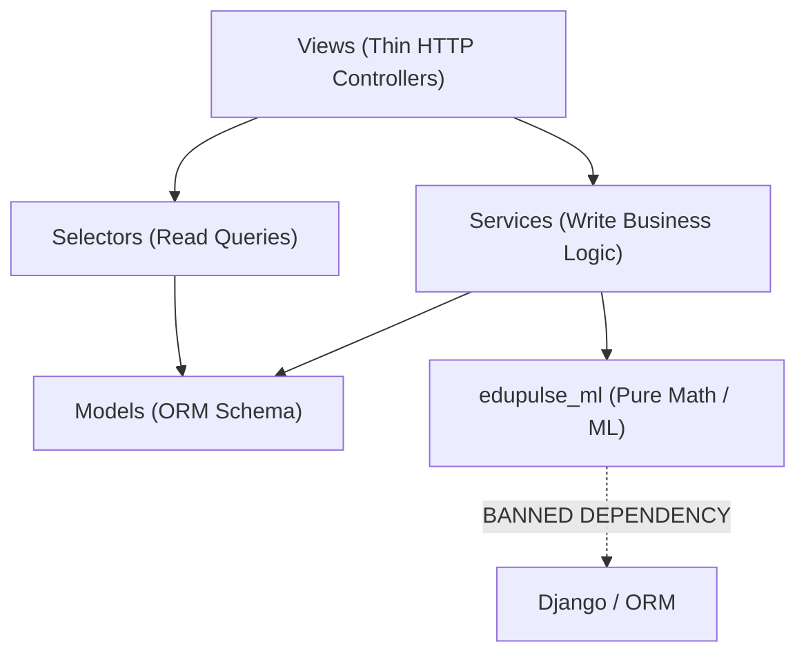

# EduPulse Architecture & System Layout

This document defines the structural architecture, package responsibilities, and directional dependency rules for the EduPulse codebase.

---

## 1. Directory Layout

```
edupulse/
├── backend/
│   ├── manage.py
│   ├── config/                     # Project configuration & settings
│   │   ├── __init__.py
│   │   ├── asgi.py
│   │   ├── wsgi.py
│   │   ├── urls.py
│   │   └── settings/
│   │       ├── __init__.py
│   │       ├── base.py             # Shared settings & environment guards
│   │       ├── dev.py              # Local development (edupulse_dev)
│   │       ├── test.py             # Test suite (edupulse_test)
│   │       ├── e2e.py              # Browser tests (edupulse_e2e)
│   │       └── prod.py             # Production settings (hardened security)
│   ├── apps/
│   │   ├── __init__.py
│   │   ├── accounts/               # Authentication, user roles, permissions, dashboards
│   │   │   ├── models.py
│   │   │   ├── permissions.py      # Role-based access control & scoping
│   │   │   ├── selectors.py        # Dashboard telemetry & context loaders
│   │   │   ├── views/              # Feature views (dashboard, auth)
│   │   │   └── urls.py
│   │   ├── academics/              # Academic hierarchy, marks, and habit logs
│   │   │   ├── models.py
│   │   │   ├── selectors.py        # Result queries & semester summaries
│   │   │   ├── services/           # CSV marks processing & habit streak calculations
│   │   │   ├── views/              # Results, internal marks, habit check-in views
│   │   │   └── urls.py
│   │   ├── predictions/            # ML model registry, PredictorService, at-risk radar
│   │   │   ├── models.py           # ModelVersion, PredictionSnapshot
│   │   │   ├── services.py         # Batch inference engine & model router
│   │   │   ├── selectors.py        # Snapshot loaders & scope queries
│   │   │   ├── explain.py          # Plain-language factor explanations
│   │   │   ├── views/              # Student forecast & staff at-risk radar
│   │   │   └── urls.py
│   │   └── analytics/              # Multi-tier statistical engine & cohort query API
│   │       ├── apps.py
│   │       ├── engine.py           # 5-number summaries, pass-rate trends
│   │       ├── views.py            # Analytics cockpit dispatcher & API
│   │       └── urls.py
│   ├── edupulse_ml/                # Pure framework-free ML package (Zero Django)
│   │   ├── contract.py             # Feature contract & banned attribute enforcement
│   │   ├── datasets/               # Feature extractors (anti-leakage)
│   │   ├── train_a.py              # Baseline model training
│   │   ├── train_b.py              # Institute model training (grouped CV)
│   │   ├── evaluate.py             # Metrics computation
│   │   └── fairness.py             # Demographic parity audit
│   ├── templates/                  # Server-rendered HTML templates
│   └── static/                     # CSS, icons, and JavaScript assets
├── frontend/                       # React + TypeScript single-page app (Vite)
├── docs/                           # Architectural, ML contract, and data governance docs
├── tests/                          # Automated pytest test suites
└── docker/                         # Containerization stack (PostgreSQL, Redis)
```

---

## 2. Package Responsibilities

| Package | Responsibility |
|---|---|
| `backend.config` | Root configuration, environment resolution (`django-environ`), WSGI/ASGI handlers, and root URL dispatching. |
| `backend.apps.accounts` | User identity (`User`), role definitions (Student, Teacher, HOD, Dean, VC, Admin), permissions decorators, and home dashboards. |
| `backend.apps.academics` | University structure (`University`, `School`, `Department`, `Course`, `Batch`, `Subject`), official grades, faculty marks entry, and student habit check-in telemetry. |
| `backend.apps.predictions` | Active model slot registry (`ModelVersion`), batch matrix inference (`PredictorService`), dynamic model router, plain-language explanations, and historical audit snapshots (`PredictionSnapshot`). |
| `backend.apps.analytics` | Multi-tier statistical analytics engine (min, Q1, median, Q3, max), topper/failure analytics, and scoped cohort query endpoints. |
| `backend.edupulse_ml` | Framework-free machine learning core containing governance contracts, model training pipelines, cross-validation, and fairness auditing. Strictly zero Django or database dependencies. |
| `frontend` | Modern client-side React + TypeScript interface interacting with versioned REST APIs. |

---

## 3. Directional Dependency Rules



### Rule 1: Thin Views (< 40 lines)
View functions must act solely as HTTP dispatchers: authenticate the request, extract parameters, delegate to a `selector` or `service`, and render the template or return JSON. No view function may contain multi-step aggregation algorithms, raw CSV parsing loops, or direct file I/O.

### Rule 2: Separation of Reads and Writes
* **`selectors.py`**: Read-only database queries, filtering, and aggregation. Never performs database mutations (`save()`, `create()`, `update()`, `delete()`).
* **`services.py`**: Business mutations, state transitions, batch processing, and write operations.

### Rule 3: `edupulse_ml` Framework Independence
`edupulse_ml` is completely decoupled from Django, SQLite, PostgreSQL, and web frameworks. It relies solely on the Python Standard Library, `numpy`, `pandas`, and `scikit-learn`.
* Code under `edupulse_ml/` **MUST NEVER** import `django`, `django.db`, or any Django model.
* This guarantees that model training and mathematical evaluation pipelines can run in standalone compute environments (such as CLI worker nodes, Airflow, or serverless functions) without spinning up a Django runtime.

### Rule 4: Server-Enforced Access Control
* Client requests never pass their role or scope (e.g. `?role=teacher` is ignored).
* The server always derives the user's role and data slice directly from the authenticated session.
