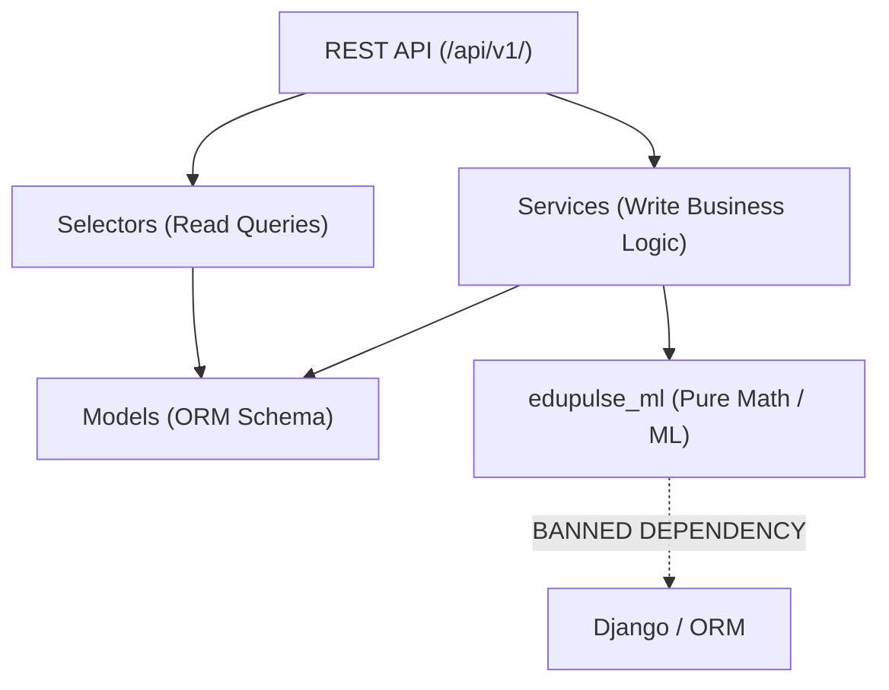

# EduPulse Architecture & System Layout

This document defines the structural architecture, package responsibilities, and directional dependency rules for the EduPulse codebase.

---

## 1. Directory Layout

```
edupulse/
├── backend/
│   ├── manage.py
│   ├── config/                     # Project configuration & settings
│   │   ├── __init__.py
│   │   ├── asgi.py
│   │   ├── wsgi.py
│   │   ├── urls.py                 # Root router dispatches to /api/v1/, /app/, /admin/
│   │   └── settings/
│   │       ├── __init__.py
│   │       ├── base.py             # Shared settings & environment guards
│   │       ├── dev.py              # Local development (edupulse_dev)
│   │       ├── test.py             # Test suite (edupulse_test)
│   │       ├── e2e.py              # Browser tests (edupulse_e2e)
│   │       └── prod.py             # Production settings (hardened security)
│   ├── apps/
│   │   ├── accounts/               # Authentication, user roles, permissions, selectors
│   │   │   ├── models.py
│   │   │   ├── permissions.py      # Role-based access control & scoping
│   │   │   └── selectors.py        # Dashboard telemetry & context loaders
│   │   ├── academics/              # Academic hierarchy, marks, and habit logs
│   │   │   ├── models.py
│   │   │   ├── selectors.py        # Result queries & semester summaries
│   │   │   └── services/           # CSV marks processing & habit streak calculations
│   │   ├── predictions/            # ML model registry, PredictorService, at-risk radar
│   │   │   ├── models.py           # ModelVersion, PredictionSnapshot
│   │   │   ├── services.py         # Batch inference engine & model router
│   │   │   ├── selectors.py        # Snapshot loaders & scope queries
│   │   │   └── explain.py          # Plain-language factor explanations
│   │   ├── analytics/              # Multi-tier statistical engine & scoped analytics API
│   │   │   ├── apps.py
│   │   │   ├── engine.py           # 5-number summaries, pass-rate trends
│   │   │   ├── api_views.py        # DRF scoped analytics API family
│   │   │   ├── selectors.py        # Fast database-level aggregations
│   │   │   └── tasks.py            # Celery cache warming tasks
│   │   ├── api/                    # Core versioned JSON REST API (/api/v1/)
│   │   │   ├── views.py            # Auth, /me, results, predictions, marks, models
│   │   │   ├── serializers.py      # OpenAPI schema validation & contracts
│   │   │   ├── permissions.py      # Capability & scope permissions
│   │   │   └── urls.py
│   │   └── core/                   # Infrastructure: SPA serving, health, logging
│   │       ├── middleware.py       # Security & no-cache headers
│   │       └── spa.py              # Built Vite React SPA serving with index.html fallback
│   ├── edupulse_ml/                # Pure framework-free ML package (Zero Django)
│   │   ├── contract.py             # Feature contract & banned attribute enforcement
│   │   ├── datasets/               # Feature extractors (anti-leakage)
│   │   ├── train_a.py              # Baseline model training
│   │   ├── train_b.py              # Institute model training (grouped CV)
│   │   ├── evaluate.py             # Metrics computation
│   │   └── fairness.py             # Demographic parity audit
│   ├── templates/                  # Minimal error templates (400, 403, 403_csrf, 404, 500)
│   └── static/                     # Static assets & minimal error CSS (no external fonts)
├── frontend/                       # React + TypeScript single-page app (Vite)
├── docs/                           # Architectural, ML contract, and data governance docs
├── tests/                          # Automated pytest test suites (unit, integration, e2e)
└── docker/                         # Containerization stack (PostgreSQL, Redis)
```

---

## 2. Package Responsibilities

| Package | Responsibility |
|---|---|
| `backend.config` | Root configuration, environment resolution (`django-environ`), WSGI/ASGI handlers, and root URL dispatching to `/api/v1/`, `/app/`, `/admin/`. |
| `backend.apps.accounts` | User identity (`User`), role definitions (Student, Teacher, HOD, Dean, VC, Admin), role/scope authorization logic, and permission evaluation. |
| `backend.apps.academics` | University structure (`University`, `School`, `Department`, `Course`, `Batch`, `Subject`), official grades, faculty marks entry, and student habit check-in telemetry. |
| `backend.apps.predictions` | Active model slot registry (`ModelVersion`), batch matrix inference (`PredictorService`), dynamic model router, plain-language explanations, and historical audit snapshots (`PredictionSnapshot`). |
| `backend.apps.analytics` | Scoped analytics API family (`/api/v1/analytics/`), database-level multi-tier aggregations, and Celery cache warming tasks. |
| `backend.apps.api` | Core versioned REST API (`/api/v1/`) exposing authentication, `/me` capabilities, results, predictions, habits, teaching assignments, and the model registry. |
| `backend.apps.core` | Production Single-Page Application serving at `/app/` with index fallback, security headers, and MIME resolution. |
| `backend.edupulse_ml` | Framework-free machine learning core containing governance contracts, model training pipelines, cross-validation, and fairness auditing. Strictly zero Django or database dependencies. |
| `frontend` | Modern client-side React + TypeScript single-page interface consuming the OpenAPI-generated client with cookie-based session auth and strict CSP. |

---

## 3. Directional Dependency Rules


```mermaid
graph TD
    API["REST API (/api/v1/)"] --> Selectors["Selectors (Read Queries)"]
    API --> Services["Services (Write Business Logic)"]
    Selectors --> Models["Models (ORM Schema)"]
    Services --> Models
    Services --> EduPulseML["edupulse_ml (Pure Math / ML)"]
    EduPulseML -.->|BANNED DEPENDENCY| DjangoFramework["Django / ORM"]
```

### Rule 1: Thin API Controllers (< 40 lines)
API view methods act solely as HTTP dispatchers: authenticate the request, validate payloads via serializers, delegate to a `selector` or `service`, and return serialized JSON. No view function contains multi-step aggregation algorithms, raw CSV parsing loops, or direct file I/O.

### Rule 2: Separation of Reads and Writes
* **`selectors.py`**: Read-only database queries, filtering, and aggregation. Never performs database mutations (`save()`, `create()`, `update()`, `delete()`).
* **`services.py`**: Business mutations, state transitions, batch processing, and write operations.

### Rule 3: `edupulse_ml` Framework Independence
`edupulse_ml` is completely decoupled from Django, SQLite, PostgreSQL, and web frameworks. It relies solely on the Python Standard Library, `numpy`, `pandas`, and `scikit-learn`.
* Code under `edupulse_ml/` **MUST NEVER** import `django`, `django.db`, or any Django model.
* This guarantees that model training and mathematical evaluation pipelines can run in standalone compute environments without spinning up a Django runtime.

### Rule 4: Server-Enforced Access Control
* Client requests never pass their role or scope (e.g. `?role=teacher` is ignored).
* The server always derives the user's role and data slice directly from the authenticated session.
